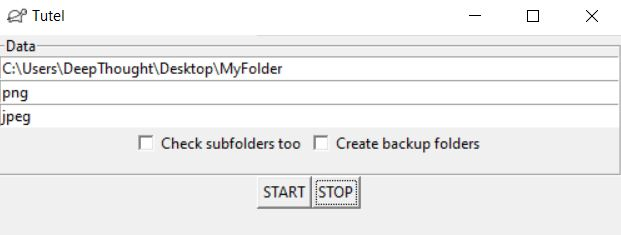

# Tutel
Small app to convert big amounts of files from an extension to another

## How does it work?
Start the program, write the directory where the files you want to convert are stored and pick the extension you want to convert into another, then press the start button. If you wish you can also convert the files in the subfolders, just check the corresponding option. If you want you can also create backup folders to store the original files with the original extension, instead of just converting them. This program is intended to convert big amounts of files like you would do manually changing the extension at the end of the file names. 

This is an example of inputs you could insert before pressing the start button:

